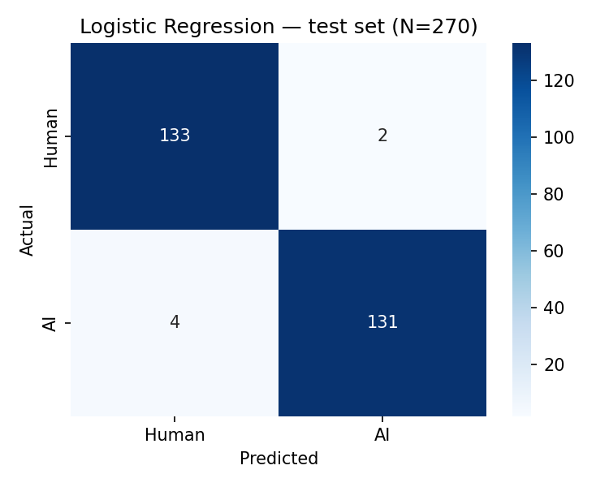
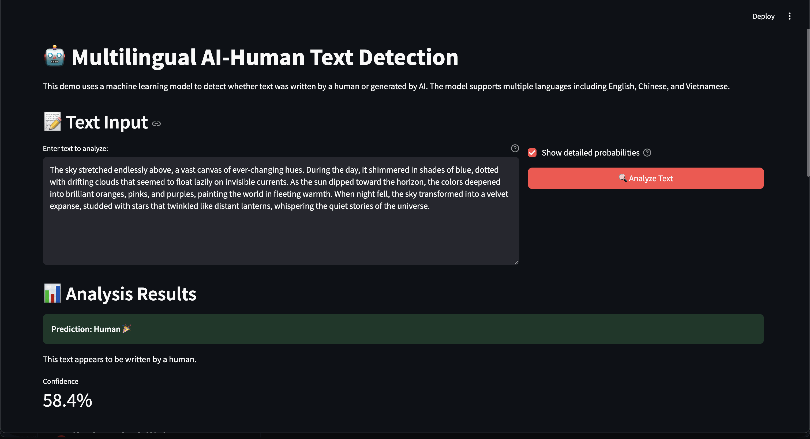

# Multilingual AI-Human Text Detection

[](https://github.com/vutuongvy101/multilingual-ai-human-text-detection/actions/workflows/ci.yml)

Binary classifier for detecting AI-generated vs human-written text across English, Chinese, and Vietnamese. Built as an **AI content forensics** research project: given a passage, estimate whether it was written by a person or produced by a language model — the same class of problem tackled by content-authenticity teams (e.g. Truuth).

Implements TF-IDF statistical baselines (Logistic Regression, Naive Bayes) and fine-tuned transformers (DistilBERT, XLM-RoBERTa), with per-language evaluation to measure cross-lingual generalization.

## Features

- **Multilingual support**: English, Chinese, Vietnamese (300 QA pairs per language)
- **Model architectures**: LogReg, Multinomial NB, DistilBERT, XLM-RoBERTa
- **Data pipeline**: Collection, preprocessing, AI answer generation (Qwen2.5-1.5B-Instruct)
- **Per-language evaluation**: Cross-lingual transfer analysis
- **REST API**: FastAPI server for real-time classification
- **Web demo**: Streamlit interface
- **Test suite**: `pytest` coverage for core utilities

## Results

Test-set F1 by model and language (70/15/15 prompt-level split, seed=42). Statistical models use TF-IDF (1–2 grams, `min_df=2`, jieba segmentation for Chinese). Transformer results from fine-tuning with identical hyperparameters (`lr=2e-5`, `max_length=256`, 3 epochs). Full methodology in [`notebooks/48706094_assignment1.ipynb`](notebooks/48706094_assignment1.ipynb).

| Model | EN | ZH | VI | Overall |
|-------|-----|-----|-----|---------|
| Logistic Regression | 0.9778 | 0.9545 | 1.0000 | **0.9776** |
| Multinomial NB | 0.9318 | 0.8350 | 1.0000 | 0.9181 |
| DistilBERT | 0.9773 | 0.7838 | 0.9091 | 0.8960 |
| XLM-RoBERTa | 0.9890 | 0.9462 | 0.9783 | **0.9710** |



### Findings

**Chinese transfers worst for monolingual models.** DistilBERT drops to F1 0.7838 on ZH (vs 0.9773 on EN) because it is pre-trained on English only — Chinese characters are tokenised into meaningless subword fragments. Multinomial NB shows a similar pattern on ZH (0.8350), likely because n-gram features capture less discriminative signal across scripts without contextual embeddings.

**XLM-RoBERTa generalises across all three languages** (F1 0.946–0.989 per language), confirming that multilingual pre-training is necessary for reliable cross-lingual AI-content detection.

**Vietnamese is easiest in this corpus** for statistical models (F1 1.0000), possibly because the crawled Reddit answers and Qwen-generated responses are more stylistically distinct than the HC3-sourced EN/ZH pairs.

### Known limitations

- **Domain shift**: Models are trained on QA-style forum answers; performance on news articles, legal text, or social-media posts is untested and likely lower.
- **Translation effects**: EN and ZH data come from HC3 (different sources and topics than the Vietnamese crawl); cross-language comparison mixes domain variation with language variation.
- **Generator specificity**: AI labels come from a single model (Qwen2.5-1.5B-Instruct); detectors may not generalise to GPT-4, Claude, or other generators without retraining.
- **Small test set**: 90 samples per language (270 total) — strong results should be confirmed with repeated runs and held-out domains.

## Quick Start

### Hosted Transformer Model

The fine-tuned multilingual XLM-RoBERTa checkpoint is also available on Hugging Face:

- Model: [`bibbbu/multilingual-ai-human-detector_xlm-roberta-base`](https://huggingface.co/bibbbu/multilingual-ai-human-detector_xlm-roberta-base)

### Installation

```bash
git clone https://github.com/vutuongvy101/multilingual-ai-human-text-detection.git
cd multilingual-ai-human-text-detection

python -m venv .venv-multilingual-ai-detection
source .venv-multilingual-ai-detection/bin/activate

# Recommended: install the package with development, data, and visualisation extras
pip install -e ".[dev,data,viz]"
```

### Data Setup

Dataset JSONL files live in `data/`:

```
data/
├── en_qa.jsonl
├── zh_qa.jsonl
└── vi_qa.jsonl
```

To regenerate them, use the notebooks in `notebooks/` (see [docs/data.md](docs/data.md)).

### Training

Train a model before running transformer inference or pointing the API at a local transformer checkpoint. A pre-trained statistical model is already included at `models/statistical/`. If you want a hosted transformer instead, the Streamlit demo can load `bibbbu/multilingual-ai-human-detector_xlm-roberta-base` directly from Hugging Face Hub.

```bash
# Statistical model (minutes, CPU-friendly)
python scripts/train_statistical.py
# Saves to models/statistical/

# Transformer model (GPU recommended)
python scripts/train_transformer.py --model-name xlm-roberta-base
# Saves to models/transformer/
```

If training XLM-RoBERTa on Apple Silicon fails with an MPS out-of-memory error, reduce the per-step memory and keep a similar effective batch size with gradient accumulation:

```bash
python scripts/train_transformer.py \
    --model-name xlm-roberta-base \
    --batch-size 2 \
    --eval-batch-size 2 \
    --gradient-accumulation-steps 8 \
    --max-length 256
```

### Demo

```bash
python scripts/demo.py
```

Loads the multilingual dataset, trains a statistical model on the fly, and runs sample inference.

### Inference

```bash
# Single text (uses bundled statistical model by default)
python scripts/infer.py --text "Your text here" \
    --model-path models/statistical --model-type statistical

# Transformer model (after training)
python scripts/infer.py --text "Your text here" \
    --model-path models/transformer --model-type transformer

# Batch inference from file
python scripts/infer.py --text-file input.txt --output-file results.json \
    --model-path models/statistical --model-type statistical
```

### API Server

The API loads a trained model on startup. The default is the bundled statistical model at `models/statistical/`. If no checkpoint is found, `/predict` returns `503 Model not loaded`.

```bash
# Start with default statistical model
python scripts/serve_api.py

# Or point to a fine-tuned transformer (after training)
MODEL_PATH=models/transformer MODEL_TYPE=transformer python scripts/serve_api.py

# Verify the model loaded
curl http://localhost:8000/
# {"model_loaded": true, "model_type": "statistical", ...}

# Health check
curl http://localhost:8000/health

# Classify text
curl -X POST "http://localhost:8000/predict" \
     -H "Content-Type: application/json" \
     -d '{"text": "Your text to classify"}'
```

### Web Demo

```bash
streamlit run scripts/web_demo.py
```

Visit `http://localhost:8501`.

The web app lets you choose between:

- the bundled local statistical baseline at `models/statistical`
- the hosted Hugging Face transformer `bibbbu/multilingual-ai-human-detector_xlm-roberta-base`



### Tests

```bash
pytest tests/
```

## Data

| Language | Source | Samples |
|----------|--------|---------|
| English | HC3 (`reddit_eli5`) | 300 QA pairs |
| Chinese | HC3-Chinese (`open_qa`) | 300 QA pairs |
| Vietnamese | Crawled from Vietnamese Reddit communities | 300 QA pairs |

Each pair has one human answer and one AI answer (Qwen2.5-1.5B-Instruct). See [docs/data.md](docs/data.md) for collection details.

## Project Structure

```
├── data/                    # JSONL datasets (en/zh/vi_qa.jsonl)
├── docs/                    # Documentation and result images
├── models/                  # Trained checkpoints (statistical included)
├── notebooks/               # Experiments and assignment notebook
├── scripts/                 # Training, inference, API, and demos
├── src/multilingual_ai_detection/
├── tests/
├── requirements.txt
└── pyproject.toml
```

## Development

```bash
# Format
black src/ tests/

# Lint
flake8 src/ tests/
```

See [CONTRIBUTING.md](CONTRIBUTING.md) for contribution guidelines.

## Citation

```bibtex
@misc{vu2024multilingual,
  title={Multilingual AI-Human Text Detection},
  author={Tuong Vy Vu},
  year={2024},
  publisher={GitHub},
  url={https://github.com/vutuongvy101/multilingual-ai-human-text-detection}
}
```

## License

MIT License — see [LICENSE](LICENSE).

## Contact

Tuong Vy Vu — [LinkedIn](https://www.linkedin.com/in/tuong-vy-vu-260153177/)

Project: [github.com/vutuongvy101/multilingual-ai-human-text-detection](https://github.com/vutuongvy101/multilingual-ai-human-text-detection)
